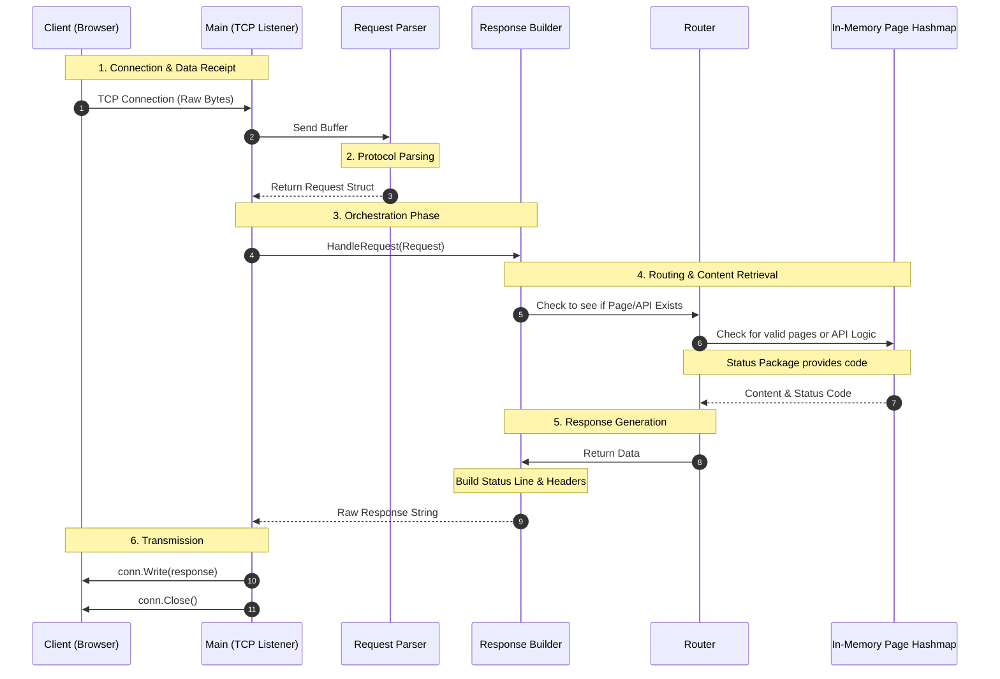

# Go-Raw-HTTP
A custom web server made purely with GO only using raw TCP packets


#### My inspiration for this project 

I wanted to gain a deeper understanding of how web servers like nginx and apache 
web server functioned at a low level and gain experience handling sockets 

#### Current  Benchmarks

4 Threads, 100 concurent connections 
| Thread Stats | Avg   | Stdev  | Max     | +/- Stdev |
| ------------ | ----- | ------ | ------- | --------- |
| Latency      | 14.37ms   | 21.96ms  | 303.01ms  | 92.48%    |
| Req/Sec      | 2.61k  | 1.06k  | 4.67k   | 61.71%   |

    311904 Requests in 30.03s
    Transfer/sec: 10.83MB

#### Features To do list


- [x] **Manual TCP Handshake Handling**: Established using the `net` package without `net/http`.
- [x] **Custom HTTP Status Error Handling**
- [x] **HTTP Request Parser**: Decodes raw byte buffers into structured Go objects.
- [x] **HTTP Response Generator**: Manually constructs protocol-compliant response strings.
- [x] **Dynamic Route Mapping**: Page/API routing logic 
- [x] **Add CSS and JS support**: Expanding the `In-Memory Page Hashmap` to handle non-HTML assets.
- [ ] **Add TLS**: Implementing secure communication via `crypto/tls`.
- [ ] **Implement GitHub Actions CI/CD**: Automating testing and deployment workflows.
- [x] **Containerize the server via Docker**: Creating a lightweight environment for deployment.
- [ ] **Implement LRU Cache**: Optimizing memory usage for high-traffic static assets.

#### Usage & Setup

1. Clone the repo
```git clone https://github.com/Douty/HTTP_SERVER```
2. Start the server 
``` go run main.go ```
3. On your browser type in the url 
"http://localhost/"


## System Architecture & Request Lifecycle

## Technical Challenges

#### Handling Keep alive: Closing the tcp socket connection prematurely

##### TLDR: 

<b>The problem</b>: When trying to benchmark my web server using [wrk](https://github.com/wg/wrk), the results reported errors due to the tool expecting a peristant connection while my server only supported non peristant connections.

<b>The fix</b>: Instead of immediately closing the connection after sending a response, i made the server continuously listen for new requests using the same connection, resetting the read deadline for each new request. After the deadline has passed, the server closes the connection.  


##### Detailed: 
###### Initial Goal
I wanted to see how my current web server handle during load

So i attempted running a wrk benchmark test using 2 threads and 100 concurrent connetions. I immediately spotted something wrong as the test returned


| Thread Stats | Avg   | Stdev  | Max     | +/- Stdev |
| ------------ | ----- | ------ | ------- | --------- |
| Latency      | 12ms  | 5.36ms | 74.96ms | 78.68%    |
| Req/Sec      | 2.00k | 290.51 | 2.73K   | 71.17%    |

119608 requests in 30.02s, 124.79MB read
socket errors: connect 0, read 119606, write 0, timeout 0

requests/sec: 3984.67
transfer/sec: 4.16 MB
<br>

###### The Problem
119606 socket read errors was extremely alarming to see

I first looked inside of my docker container where my web server was running to see if any errors were being logged. All the static files were successfully loaded and i saw each request being handled properly. 

This led me into looking into the server `main` file where the socket connections are handled. Everything appeared correct.

I did some research on how wrk conducts the tests and found out that i overlooked a key `HTTP/1.1` feature, persistent connections `(Connections: Keep-Alive)`. My connection handling implementation was non persistent. 

> [!NOTE]
The server would accept the request, generate a response then send it back to the client and close the connection.
This is a HTTP/1.0 way of handling connections 

###### The Solution 

In my `handleConnection` function instead of closing the connection immedately, the server will constantly listen for more requests in the same connection until the read deadline. 
