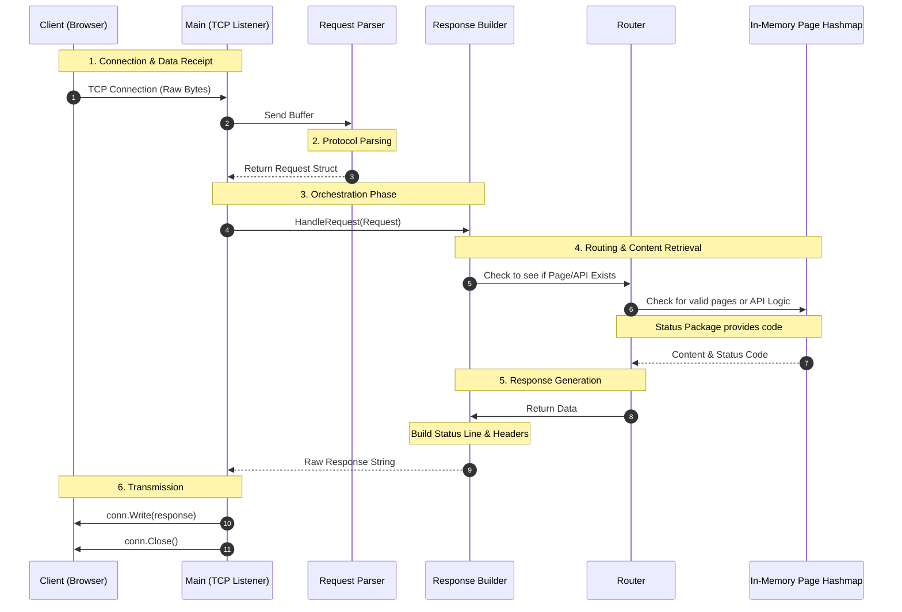

# Go-Raw-HTTP
A custom web server made purely with GO only using raw TCP packets


#### My inspiration for this project 

I wanted to gain a deeper understanding of how web servers like nginx and apache 
web server functioned at a low level and gain experience handling sockets 

#### Features To do list


- [x] **Manual TCP Handshake Handling**: Established using the `net` package without `net/http`.
- [x] **Custom HTTP Status Error Handling**
- [x] **HTTP Request Parser**: Decodes raw byte buffers into structured Go objects.
- [x] **HTTP Response Generator**: Manually constructs protocol-compliant response strings.
- [ ] **Dynamic Route Mapping**: API routing logic is currently in development.
- [ ] **Add CSS and JS support**: Expanding the `In-Memory Page Hashmap` to handle non-HTML assets.
- [ ] **Add TLS**: Implementing secure communication via `crypto/tls`.
- [ ] **Implement GitHub Actions CI/CD**: Automating testing and deployment workflows.
- [ ] **Containerize the server via Docker**: Creating a lightweight environment for deployment.
- [ ] **Implement LRU Cache**: Optimizing memory usage for high-traffic static assets.

#### Usage & Setup

1. Clone the repo
```git clone https://github.com/Douty/HTTP_SERVER```
2. Start the server 
``` go run main.go ```
3. On your browser type in the url 
"http://localhost/"


## System Architecture & Request Lifecycle

#### Technical Challenges

